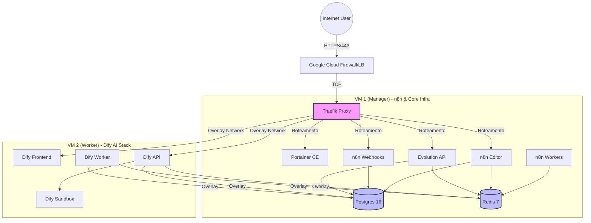

# 🚀 Infraestrutura E-commerce Alob Express (Modernizada)

Este repositório contém a definição de infraestrutura como código (IaC) baseada em **Docker Swarm** para o ecossistema de automação e inteligência artificial da Alob Express. A arquitetura foi otimizada para alta performance utilizando 2 nós (VMs) com 8GB de RAM cada, separando cargas de trabalho de IA e Automação.

## 📋 Visão Geral da Arquitetura

A infraestrutura é dividida em dois nós principais no Google Cloud (GCP):
1.  **Manager Node (VM 1):** Hospeda a infraestrutura central (Traefik, Portainer, Bancos de Dados) e o stack de Automação (n8n, Evolution API).
2.  **Worker Node (VM 2):** Dedicado exclusivamente ao stack de Inteligência Artificial (Dify), garantindo que o processamento pesado de LLMs não impacte as automações críticas.

### Diagrama de Infraestrutura



---

## 💰 Estimativa de Orçamento (Google Cloud)

Configuração otimizada para **US-Central1 (Iowa)** ou **US-East1** (aprox. 30-40% mais barato que São Paulo), permitindo o dobro de memória RAM pelo mesmo custo.

| Item | Especificação | Recurso | Custo Mensal (Est.) |
|------|---------------|---------|---------------------|
| **VM 1 (n8n)** | `e2-standard-2` | 2 vCPU, 8GB RAM, 50GB Disk | ~$50.92 |
| **VM 2 (Dify)** | `e2-standard-2` | 2 vCPU, 8GB RAM, 50GB Disk | ~$50.92 |
| **Total** | | **16GB RAM / 100GB Disk** | **~$101.84 / mês** |

*Nota: O orçamento disponível cobre confortavelmente esta configuração por 3 meses.*

---

## 🛠️ Stack Tecnológica e Versões

Todas as dependências foram atualizadas para versões estáveis (LTS) e compatíveis.

| Serviço | Versão | Função | Scaling Strategy |
|---------|--------|--------|------------------|
| **Traefik** | `v3.6.4` | Reverse Proxy & Ingress | Global (1 por nó Manager) |
| **Portainer** | `ce-2.33.5` | Gestão de Containers | Replicated (1) |
| **PostgreSQL** | `16-alpine` | Banco de Dados Relacional | Replicated (1) + Volume Persistente |
| **Redis** | `7-alpine` | Cache & Message Broker | Replicated (1) |
| **n8n** | `2.0.2` | Workflow Automation | Híbrido (Editor: 1, Webhook: 2+, Worker: Auto) |
| **Evolution API** | `v2.3.7` | WhatsApp Integration | Replicated (1+) |
| **Dify** | `1.11.1` | LLM App Development | Microserviços (Web, API, Worker) |

---

## ☁️ Requisitos de Infraestrutura (Google Cloud)

Para garantir a compatibilidade e performance na GCP:

1.  **Compute Engine (VMs):**
    *   **Região Recomendada:** `us-central1` (Iowa).
    *   **SO:** Debian GNU/Linux 12 (bookworm).
    *   **VM 1 (Manager):** e2-standard-2 (2 vCPU, 8GB RAM).
    *   **VM 2 (Worker):** e2-standard-2 (2 vCPU, 8GB RAM).
    *   **Discos:** 50GB Disco de Inicialização (Boot Disk) por VM.
    *   **Proteção de Dados:** Selecione **"Sem backups"** (economiza custos; faremos backup via aplicação).
    *   **Rede (Network):**
        *   **Firewall:** Marque ✅ **Permitir tráfego HTTP** e ✅ **Permitir tráfegos HTTPS**.
        *   **Interface de Rede:** Mantenha a opção `default`.
    *   **Nome do host (Hostname):**
        *   VM 1: `manager-n8n.internal`
        *   VM 2: `worker-dify.internal`
        *   *Nota: O Google exige "dois rótulos" (algo.algo), por isso o sufixo `.internal`.*
    *   **Observabilidade:**
        *   **Agente de operações:** Deixe **desmarcado** (economiza RAM; usaremos Portainer para monitorar).
        *   **Dispositivo de exibição:** Deixe **desmarcado**.
    *   **Segurança:**
        *   **Contas de serviço:** Mantenha o padrão (Compute Engine default service account).
        *   **Escopos de acesso:** Mantenha "Permitir acesso padrão".
        *   **VM protegida:** Mantenha os padrões (vTPM e Monitoramento de integridade marcados; Inicialização segura desmarcada).
    *   **Avançado:**
        *   **Proteção contra exclusão:** Recomendo marcar ✅ (evita apagar a VM sem querer).
        *   **Automação (Script de inicialização):** Deixe em branco (vamos rodar manualmente).
        *   **Outros:** Mantenha os padrões.
    *   **⚠️ IMPORTANTE:** Na seção "Contêiner" (Container), mantenha a opção **"Implantar contêiner" DESMARCADA**. A instalação do Docker será feita manualmente via script.
2.  **Firewall Rules (Avançado/VPC):**
    *   *Automático:* Ao marcar HTTP/HTTPS acima, as portas 80/443 são liberadas.
    *   *Interno:* A rede `default` do GCP geralmente já permite comunicação interna entre as VMs. Caso precise configurar manualmente: `2377` (TCP), `7946` (TCP/UDP), `4789` (UDP).
3.  **Discos:**
    *   SSD Persistente para volumes de banco de dados (`/var/lib/docker/volumes`).

---

## 🚀 Guia de Deploy Passo-a-Passo

### 1. Preparação do Ambiente
Execute os scripts de configuração inicial na raiz do nó Manager.

```bash
# Dar permissão de execução
chmod +x 01.setup-docker.sh 02.setup-swarm.sh

# 1. Instalar Docker e Dependências
./01.setup-docker.sh

# 2. Inicializar o Swarm e criar redes (network_swarm_public)
./02.setup-swarm.sh
```

### 1.1 Configuração Multi-VM (Separação de Workloads)
**CRÍTICO:** Para que a separação funcione conforme o diagrama, você DEVE aplicar as labels nos nós:

```bash
# 1. Identifique os IDs/Hostnames
docker node ls

# 2. Na VM 1 (Manager) - Onde rodará n8n e Evolution
docker node update --label-add app=n8n <HOSTNAME_VM_1>

# 3. Na VM 2 (Worker) - Onde rodará Dify
docker node update --label-add app=dify <HOSTNAME_VM_2>
```

### 2. Deploy da Camada de Infraestrutura Base
Ordem crítica de inicialização para garantir disponibilidade de banco e proxy.

```bash
# 1. Proxy Reverso (Traefik)
docker stack deploy -c 04.traefik.yaml traefik

# 2. Gestão (Portainer)
docker stack deploy -c 05.portainer.yaml portainer

# 3. Bancos de Dados (Aguardar 30s após deploy para inicialização)
docker stack deploy -c 06.postgres.yaml database
docker stack deploy -c 07.redis.yaml cache
```

### 3. Deploy das Aplicações de Negócio

**Automação (n8n & Evolution):**
O n8n está configurado em modo fila (Queue Mode) para alta performance.
```bash
# Editor (Interface)
docker stack deploy -c 08.n8n-editor.yaml n8n_editor

# Workers (Processamento Pesado)
docker stack deploy -c 09.n8n-workers.yaml n8n_worker

# Webhooks (Alta Concorrência HTTP)
docker stack deploy -c 10.n8n-webhooks.yaml n8n_webhook

# Evolution API (WhatsApp)
docker stack deploy -c 16.evolution_v2.yml evolution
```

**Inteligência Artificial (Dify):**
Stack completa de GenAI.
```bash
# Sandbox de Execução de Código
docker stack deploy -c 12-dify-sandbox.yaml dify_sandbox

# Interface Web
docker stack deploy -c 13-dify-web.yaml dify_web

# API Core
docker stack deploy -c 14-dify-api.yaml dify_api

# Processamento em Background
docker stack deploy -c 15-dify-worker.yaml dify_worker
```

---

## ⚠️ Plano de Atualização Sequencial (Major Version Upgrade)

Use este procedimento para atualizar sua infraestrutura existente para as novas versões (Traefik v3, n8n v2, Dify v1.11).

### 1. Backup Preventivo
Antes de iniciar, faça backup dos volumes de banco de dados.
```bash
# Exemplo de backup do Postgres
docker exec $(docker ps -q -f name=database_postgres) pg_dumpall -U postgres > backup_full_$(date +%F).sql
```

### 2. Atualização da Infraestrutura (Traefik v3 & Portainer)
O Traefik v3 possui mudanças na configuração do Provider Swarm.
```bash
# 1. Atualizar Traefik (Pode haver breve interrupção no roteamento)
docker stack deploy -c 04.traefik.yaml traefik

# 2. Atualizar Portainer
docker stack deploy -c 05.portainer.yaml portainer
```

### 3. Atualização das Aplicações
```bash
# 1. Atualizar Evolution API
docker stack deploy -c 16.evolution_v2.yml evolution

# 2. Atualizar n8n (v2)
docker stack deploy -c 08.n8n-editor.yaml n8n_editor
docker stack deploy -c 09.n8n-workers.yaml n8n_worker
docker stack deploy -c 10.n8n-webhooks.yaml n8n_webhook

# 3. Atualizar Dify (v1.11)
# Recomendado reiniciar a stack completa para garantir migrações de banco
docker stack rm dify_api dify_web dify_worker dify_sandbox
# Aguarde os serviços pararem...
docker stack deploy -c 12-dify-sandbox.yaml dify_sandbox
docker stack deploy -c 14-dify-api.yaml dify_api
docker stack deploy -c 13-dify-web.yaml dify_web
docker stack deploy -c 15-dify-worker.yaml dify_worker
```

---

## ⚡ Otimizações e Melhores Práticas Implementadas

### 1. n8n (Queue Mode)
*   **Separação de Responsabilidades:** O tráfego de webhooks não impacta o editor nem o processamento de workflows longos.
*   **Escalabilidade:** Para aumentar a capacidade de processamento, basta escalar os workers:
    ```bash
    docker service scale n8n_worker_worker=5
    ```

### 2. Dify (High Availability)
*   **Worker Dedicado:** Tarefas assíncronas (RAG, Indexação) são processadas separadamente da API principal via Celery/Redis.
*   **Sandbox Isolado:** Execução de código Python/NodeJS isolada para segurança.

### 3. Segurança & Manutenção
*   **Redes Isoladas:** O tráfego de banco de dados (`network_swarm_db` implícita ou interna) não é exposto publicamente. Apenas serviços com `network_swarm_public` falam com o Traefik.
*   **Constraints de Deploy:** Serviços críticos (Bancos) fixados em nós Managers ou com volumes persistentes garantidos.
*   **Resource Limits:** Todos os serviços possuem limites de CPU e RAM definidos para evitar "Noisy Neighbor" nas VMs.

---

## 🛡️ Checklist de Segurança e Manutenção

- [ ] **Backup Diário:** Configurar cronjob para dump do Postgres (`pg_dump`) e backup do volume do n8n (`/home/node/.n8n`).
- [ ] **Monitoramento:** Verificar logs regularmente via Portainer ou configurar stack ELK/Prometheus.
- [ ] **Limpeza:** Executar semanalmente para remover imagens não utilizadas:
    ```bash
    docker system prune -af
    ```

## 🆘 Recuperação de Desastres

Em caso de falha total de um nó:
1.  Provisione nova VM.
2.  Execute `01.setup-docker.sh`.
3.  Se for Manager: Restaure o backup do diretório `/var/lib/docker/volumes`.
4.  Se for Worker: Apenas junte-o ao cluster (`docker swarm join ...`).
5.  O Swarm automaticamente redistribuirá as tarefas (tasks) para o novo nó.
